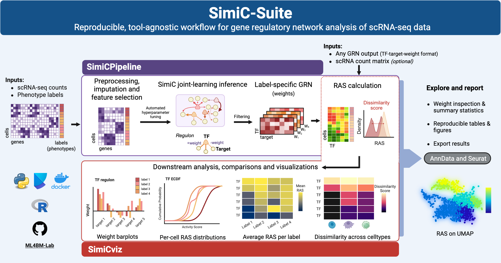

::: {.graphical-abstract}
{fig-alt="Graphical abstract summarizing the SimiC-Suite workflow from single-cell RNA-seq inputs through SimiCPipeline, SimiCviz, and downstream reporting."}
:::

## Overview

SimiC-Suite is a software suite for phenotype-specific gene regulatory network (GRN) analysis from single-cell RNA-seq data. It brings together complementary tools for GRN inference, Regulon Activity Score (RAS) calculation, and downstream assessment and visualization.

## Packages

| Package | Language / ecosystem | Purpose |
|---|---|---|
| [SimiCPipeline](https://github.com/ML4BM-Lab/SimiCPipeline) | Python | Phenotype-specific GRN inference and Regulon Activity Score (RAS) calculation. |
| [SimiCviz](https://github.com/ML4BM-Lab/SimiCviz) | R / Bioconductor | Tool-agnostic assessment and visualization of GRN outputs. |

::: {.package-band .pipeline-band}
## SimiCPipeline

[SimiCPipeline](https://github.com/ML4BM-Lab/SimiCPipeline) is the Python component of SimiC-Suite. It supports reproducible phenotype-specific GRN inference from single-cell RNA-seq data and calculation of Regulon Activity Score (RAS) values for downstream biological interpretation.

SimiCPipeline builds on the SimiC framework for phenotype-aware regulatory network analysis. Please cite the original SimiC work when using SimiCPipeline where appropriate.
:::

::: {.package-band .viz-band}
## SimiCviz

[SimiCviz](https://github.com/ML4BM-Lab/SimiCviz) is the R / Bioconductor component of SimiC-Suite. It provides tool-agnostic workflows for assessing, comparing, and visualizing GRN outputs, supporting interpretation across GRN inference methods.
:::

## Repositories

- SimiCPipeline: <https://github.com/ML4BM-Lab/SimiCPipeline>
- SimiCviz: <https://github.com/ML4BM-Lab/SimiCviz>
